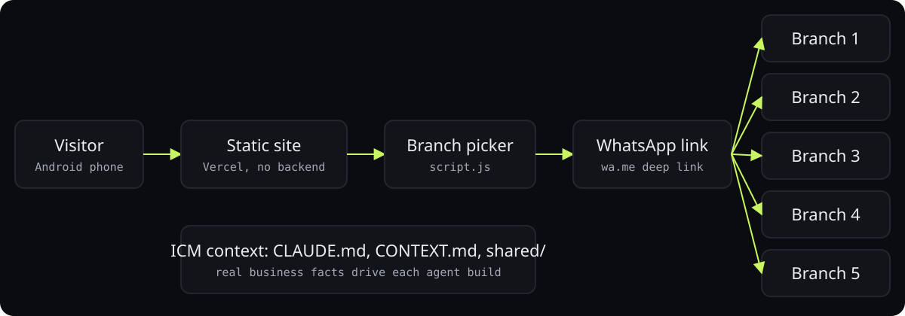
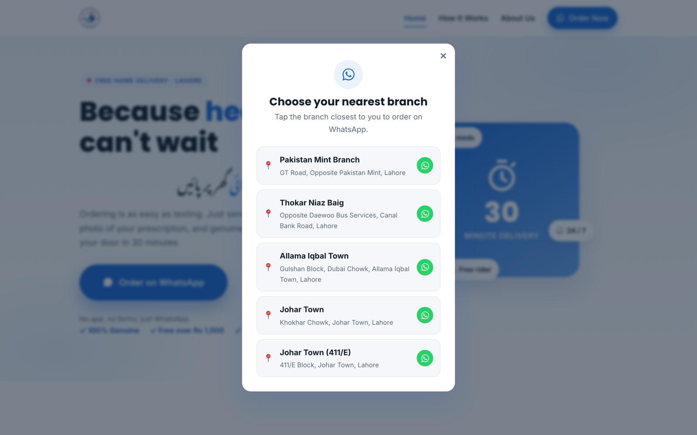
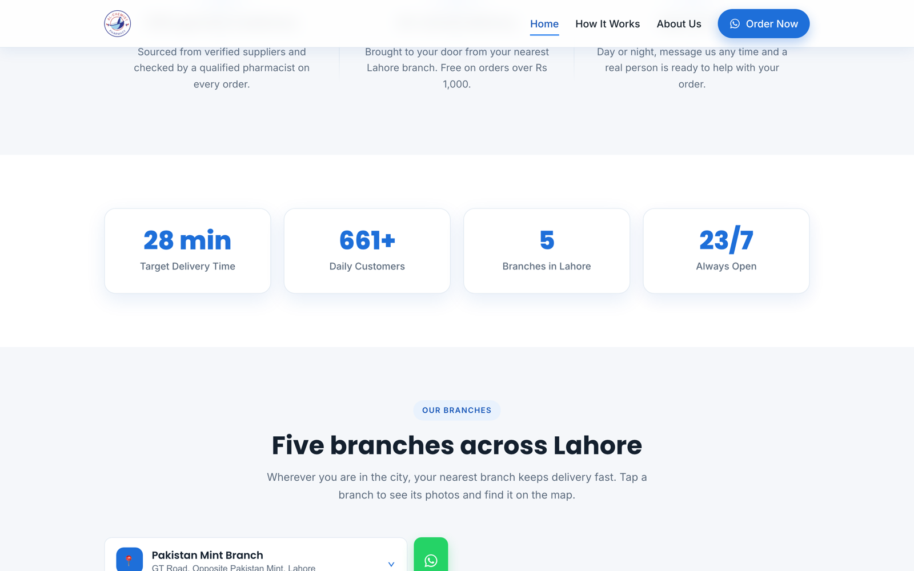

<div align="center">


# Alchemist Pharmacy

**WhatsApp-first ordering site for a five-branch Lahore pharmacy, built with an agentic workflow.**

<p>
<a href="https://alchemistpharmacy.com"></a>
<a href="https://ibiraheel.com/p/alchemist"></a>
</p>

<p>


</p>

</div>

<br>

> **300 to 545 orders a month**  
> for Alchemist Pharmacy, five branches, roughly 350 walk-in customers a day

## What it did

Every visit is routed to the nearest branch's WhatsApp in two taps. Thirty-minute delivery positioning, bilingual hero, branch galleries with live maps.

<sub>Outcome: reported by the owner.</sub>

## How it works

<p align="center"></p>

1. No backend: static HTML, CSS, and JS so the site loads instantly on cheap Android phones.
2. Area-to-branch routing runs in the browser and deep-links straight into the right WhatsApp chat.
3. Repo uses an ICM layered-context layout (CLAUDE.md, CONTEXT.md, shared facts) so AI agents build each track from real business data.
4. All assets local; the only external dependency is Google Fonts.

## Screenshots

<table>
<tr>
<td width="50%"><br><sub>Choose your nearest branch: the WhatsApp branch picker</sub></td>
<td width="50%"><br><sub>Branches accordion with gallery and map</sub></td>
</tr>
</table>

## Run it locally

```bash
npm install
npm run dev   # http://localhost:3000
```

## Repository layout

```
├── public/
│   ├── file.svg
│   ├── globe.svg
│   ├── next.svg
│   ├── vercel.svg
│   └── window.svg
├── src/
│   ├── app/
│   ├── components/
│   └── lib/
├── AGENTS.md
├── CLAUDE.md
├── eslint.config.mjs
├── next.config.ts
├── package.json
├── postcss.config.mjs
├── README.md
└── tsconfig.json
```

---

<div align="center">

<sub>Built by <a href="https://github.com/ibi-raheel">Muhammad Ibrahim Raheel</a> · more work at <a href="https://ibiraheel.com">ibiraheel.com</a></sub>

</div>
